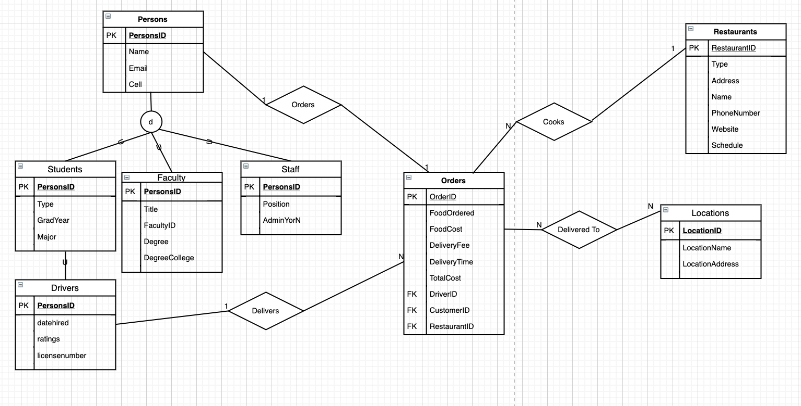

# ITCS-3160 Spring 2020 Project Assignment:

Click to view in separate webpage:
https://fsalad.github.io/ITCS-3160-ProjectRepo/

# Group Member Names:
- Ahmed Ahmed
- Milo Boger
- Muhammad Deeb
- Faisal Salad
  
# Presentation
https://www.youtube.com/watch?v=F3cGKu_ZmEE

# Outline
- Introduction:
  We will be making a test database of a campus controlled food delivery service which will be called Yum-Now. This service will allow students and faculty to order food from off campus and have it delivered safely to them by university authorized employees. Students can go into our website and pick a restaurant and order food from it, then a Yum-Now employee will pick up their food when it is ready and deliver it to an approved on campus location that the student has designated. This food delivery service will make it easy and safe to have all your favorite foods brought straight to you on campus.

- Use Case:
As a person, I want to order food, to have it delivered to my location

  
- Business Rules:
  * All delivery personnel are students that have been approved.
  * There is a flat fee of $5 per delivery.
  * Each delivery can only be associated with one person.
  * Each order can only be made for one restaurant.
  * The delivery location must be an approved place on campus.
  * Food providers must be approved before they can sell food on our app.
  * Anybody using the app must be willing to provide their campus ID, name, email, and phone number as well as extra information regarding their current school status.
  * The app will collect information about nutrition and eating habits of campus members.
  
- EERD:
  
  
- Data Dictionary:
  
  
- MySQL Queries:
  (Three queries required)
  
- Trigger:
  (Special stored procedures that are executed when a specific action occurs within database)
  
- Stored Procedure:
  (Stored procedures)
  
- Description of Future Work:
  (How this database will be implemented in the future)
  
- MySQL dump:
  (mysqldump)
